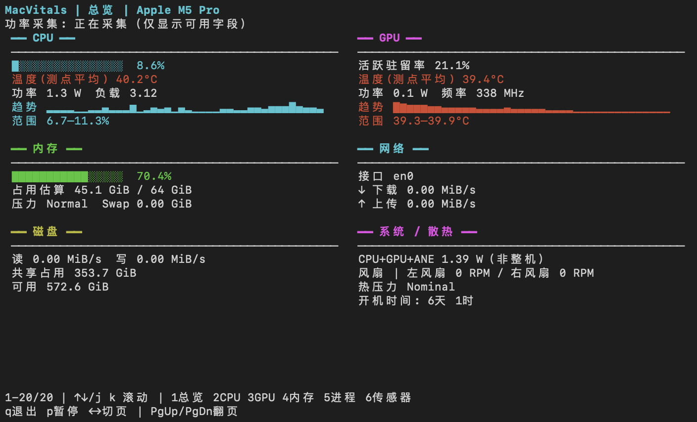
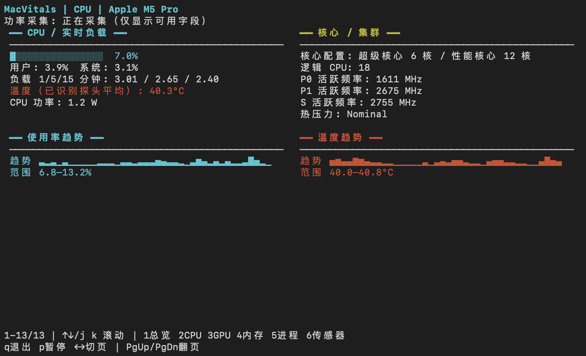
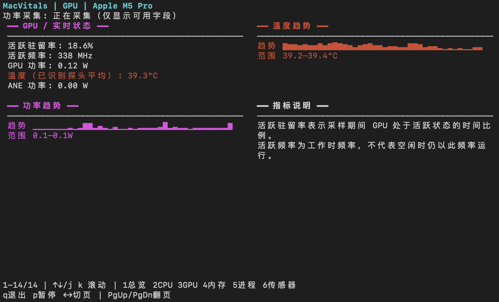
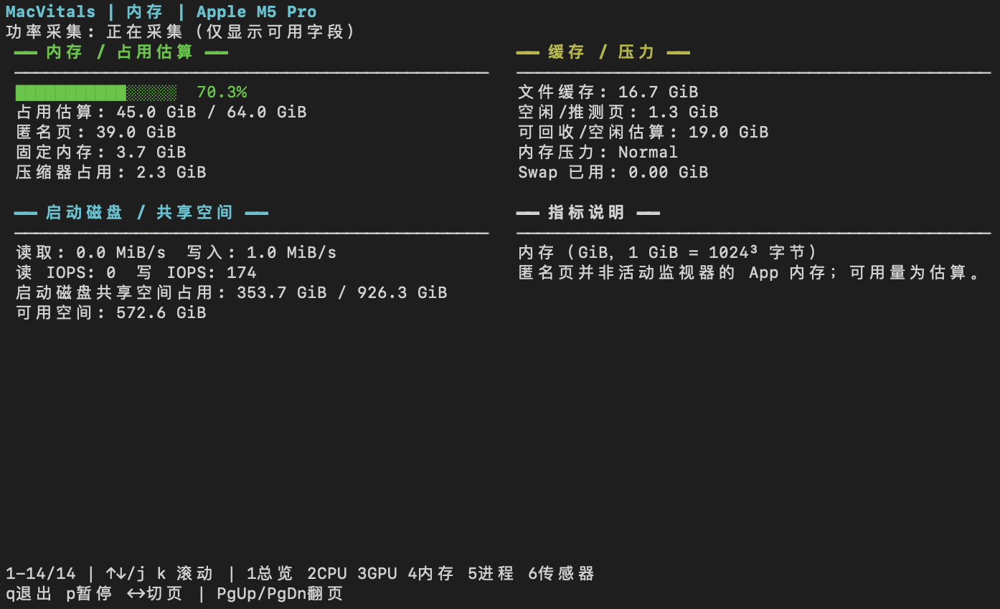
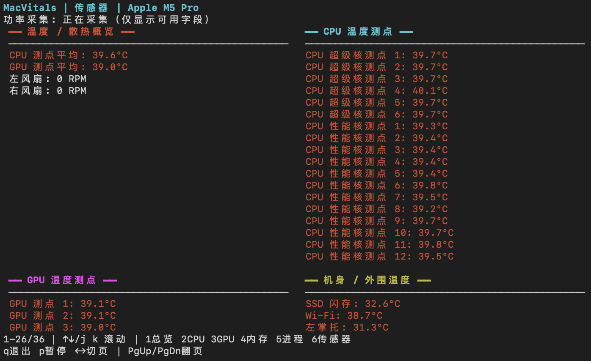

# MacVitals

[简体中文](README.md) | [English](README_EN.md)

> SSH-first live system monitor for Apple Silicon Macs.

面向 Apple Silicon Mac 的终端性能监视器。通过本机终端或 SSH，查看 CPU、GPU、内存、进程、硬件温度与风扇转速。

## 定位：为 SSH 远程观察而做

MacVitals 不是 Stats、Activity Monitor 或其他桌面 GUI 监视器的替代品，也不试图和它们争夺同一个使用场景。Stats 等工具更适合本机菜单栏、图形界面、常驻运行和历史趋势；MacVitals 的目标是另一件事：人在外面通过 SSH 连接家里的 Mac 时，用一个轻量、即时、可审计的终端界面快速判断机器现在的状态。

它坚持以下边界：

- 不依赖桌面环境，不经过第三方服务器，适合 SSH 和临时运行。
- 不保存历史记录、日志数据库、云端数据或后台同步；退出即结束本次观察。
- 保留彩色分块和清晰的页面层级，但不把无关的原始字段全部倾倒给用户。
- 对每类数据区分有效、等待、陈旧和不可用，不用 `0` 掩盖采集失败。
- 优先解释数据的来源和口径，而不是承诺和 Activity Monitor 或 Stats 的同名数字逐项相等。

如果你需要菜单栏图标、图形化设置、自动启动或历史曲线，Stats 一类 GUI 工具会更合适；如果你需要 SSH 下的即时诊断和轻量观察，MacVitals 才是它的目标场景。

使用 Python 标准库、curses 和 macOS 系统接口实现，无第三方 Python 运行依赖。系统能力和传感器布局因机型而异，不能保证所有 Apple Silicon 设备均提供相同指标。

当前版本：1.4.0。需要 Python 3.9 或更新版本。

界面沿用分块仪表盘设计：青色 CPU、紫色 GPU、绿色内存，配合使用率条、温度强调和趋势图。宽屏双栏、窄屏单栏，所有页面均可滚动。

## 界面预览



<details>
<summary>查看更多页面 / More views</summary>

### CPU



### GPU



### 内存



### 传感器



</details>

## 运行

在项目根目录执行：

```bash
python3 macvitals/macvitals.py
python3 macvitals/macvitals.py --interval 1
python3 macvitals/macvitals.py --dev       # 开发版：显示当前来源与数据年龄
python3 -m macvitals
```

可选安装命令入口（建议在虚拟环境中安装）：

```bash
python3 -m pip install .
macvitals
```

包安装和开发安装需要 pip 21.3 或更新版本；旧版 macOS 开发者工具可能附带 pip 21.2，此时仍可直接运行 `python3 macvitals/macvitals.py`，或先更新打包工具。开发时可用 `python3 -m pip install -e .`。刷新间隔范围为 0.5–10 秒。

CPU、内存、进程等基础指标通常无需管理员权限。温度与风扇由 AppleSMC 等接口读取，不依赖 powermetrics 的温度采样器；CPU/GPU 功率、频率等特权指标需要：

```bash
sudo python3 macvitals/macvitals.py
```

通过 SSH 使用时，在被监测的 Mac 上运行上述命令。权限提升不能解决系统不支持某个采样器或未知传感器映射的问题。

## 页面与快捷键

| 按键 | 功能 |
|---|---|
| `1–6` | 总览、CPU、GPU、内存、进程、传感器 |
| `← / →` | 切换页面 |
| `↑ / ↓` 或 `k / j` | 滚动页面 |
| `PgUp / PgDn`、`Home / End` | 翻页、跳至开头 / 末尾 |
| `c / m` | 进程页按 CPU / RSS 内存降序排列，并展示对应前 15 名 |
| `p` | 暂停 / 恢复监测 |
| `q` | 退出 |

终端过小时显示尺寸提示；长页面可滚动。传感器只使用有依据的友好名称，未知或不可读数据不应当作真实零值。

暂停时冻结界面并暂停常规监测；后台 powermetrics 进程仍继续运行。

`--dev` 只显示当前实时快照的来源、语义和状态，不写入历史记录或日志；正式运行不带此选项即可保持简洁界面。

## 数据口径

- **CPU：** 以整机全部逻辑 CPU 时间 = 100% 计量，通过累计计数差分计算。18 核机器上，一个核心满载约为整机 5.6%；不按异构核心的实际计算能力加权。
- **进程 CPU：** 以相邻采样间隔内累计 CPU 时间增量计算；首帧等待基线，不是进程启动以来的平均值。
- **进程内存：** RSS（常驻物理内存），不是活动监视器的 footprint；共享页可能重复计入不同进程，不能简单求和。
- **内存：** 区分实际系统压力与分类估算，不能仅用剩余内存百分比推断系统压力。
- **温度：** CPU/GPU 主温度是对应有效探头的平均值，不是最高结温；探头支持取决于机型与映射。
- **风扇：** 单位 RPM。有效 `0 RPM` 是停转，与无风扇或无法读取不同。
- **磁盘：** APFS 容量采用容器口径，避免只统计系统只读卷。
- **网络：** 以选定接口的累计计数差分计算；默认路由和 VPN 会影响接口选择，切换时需要重新建立基线。
- **功率与频率：** 由 powermetrics 提供，依赖权限、系统能力和有效采样；缺失数据不等于空闲。
- **GPU 与总功率：** 活跃驻留率是活跃时间比例，活跃频率是工作期间的频率；CPU + GPU + ANE 功率之和不是整机功耗。
- **跨工具对照：** Stats 和活动监视器的同名指标不保证同一口径。对照时先看来源、统计窗口和定义，再判断数值是否接近；不能把任一工具当作所有字段的标准答案。

## 测试

无需打开交互界面即可获取两次采样后的诊断 JSON：

```bash
python3 -m macvitals --diagnose
python3 -m macvitals --ioreport-probe
sudo python3 -m macvitals --compare-probes
sudo python3 validation/load_test.py
```

诊断输出省略进程名和命令行，包含硬件与采集能力信息；不可用数值为 `null`。特权诊断需在自己的终端中运行 `sudo python3 -m macvitals --diagnose` 并按提示输入密码。

`--ioreport-probe` 是独立的只读开发探针，会对 CPU performance states、Energy Model 和 DCP swap 做两次短采样并输出差分摘要。IOReport 是不稳定的系统接口；探针结果只用于和 `powermetrics` 做定义与窗口对照，不接入正式界面，也不保存历史。

`--compare-probes` 需要管理员权限，会在同一次短采样期间启动 `powermetrics` 和 IOReport，并输出一份一次性的对照 JSON。CPU residency、活跃频率和功率仍按各自定义解释，不会强行合并成活动监视器口径。

```bash
python3 -m unittest discover -s tests -v
```

44 项自动测试通过，包含分块颜色与列边界、开发版元数据、IOReport 摘要与对照逻辑、真实伪终端中的缩放、六页切换、排序、暂停与退出。当前复盘设备为 Apple M5 Pro（Mac17,8，18 核、64 GiB，macOS 26.6.2）；这不等于所有机型已实测。管理员模式下还完成了基线约 9%、单核、多核、恢复四阶段负载验证，以及 powermetrics 中止后的降级验证；这些检查只在内存中运行，不写历史或日志。1.3.2 已完成管理员模式同帧比对及 0.5/1 秒连续采样验证，并修复诊断过早结束导致特权字段缺失的问题。

特权验证见 [实测记录](validation/2026-09-21-m5-pro-privileged.json)，可用 `sudo python3 validation/verify_live.py` 重现（包含约两秒单核负载）。P0/P1/S 集群频率、GPU 活跃率、CPU/GPU/ANE 功率和热压力与同帧原始输出一致；单核负载约占整机 5.56%。GPU 功率采用 CPU/GPU/ANE 汇总段读数，GPU 详情段可能略有差异，不重复累加。温度是已识别测点的平均值，风扇为 SMC 转速；本轮不构成探头物理校准或功率仪校验。

普通权限采样记录见 [实机诊断 JSON](validation/2026-09-21-m5-pro.json)，更新说明见 [CHANGELOG](CHANGELOG.md)。这些是当时的验证记录，动态读数会变化。

已验证临时虚拟环境中的 wheel 安装和命令入口，以及 `xterm-256color`、`xterm`、`vt100` 真实伪终端的六页浏览、窗口缩放、排序、暂停与退出。

## 兼容性与贡献

项目主要面向 Apple Silicon。当前代码已在多台 Apple Silicon Mac 上验证，但不同芯片、Pro/Max/Ultra、风扇配置和 macOS 版本可能提供不同的传感器键、powermetrics 字段和核心拓扑。Ultra 系列目前没有本地实机验证，不把“代码能够运行”表述为“已完成 Ultra 兼容认证”。

如果你在另一台 Mac 上发现传感器映射、核心拓扑或系统命令格式问题，欢迎提交 Issue 或 Pull Request。请在报告中提供 macOS 版本、芯片型号、脱敏后的 `--diagnose` 输出和复现步骤；不要上传 sudo 密码、进程名称、个人路径或其他敏感信息。硬件映射类改动需要附带证据并保持未知值语义，合并前会逐项审核。

贡献细则见 [CONTRIBUTING.md](CONTRIBUTING.md)，安全问题请先阅读 [SECURITY.md](SECURITY.md)。

## 项目边界

本项目是实时观察工具，不控制风扇或修改系统散热策略。当前正式发行形态是 Python 源码版，不提供内置 Python 的 `.app` 或 DMG；未来是否制作独立版取决于目标 Mac 缺少 Python 是否成为实际部署障碍。许可证见 [LICENSE](LICENSE)：允许免费非商业使用，禁止商业收费；对外发布的修改版必须公开完整源码并继续使用相同条件。该许可证是项目专用的源码公开许可证，不是 OSI 认证的 Open Source License。

项目完整中文说明另同步到个人 Obsidian 库的 `Project/MacVitals`，包含产品说明、架构与算法、测试发布、兼容路线图和作品网站文案。该同步为文档快照，没有自动后台更新服务。
